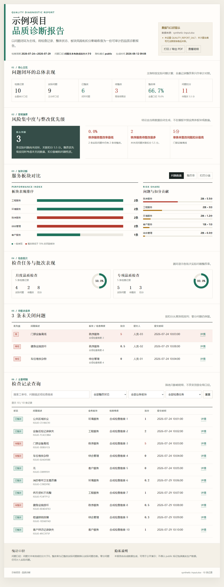
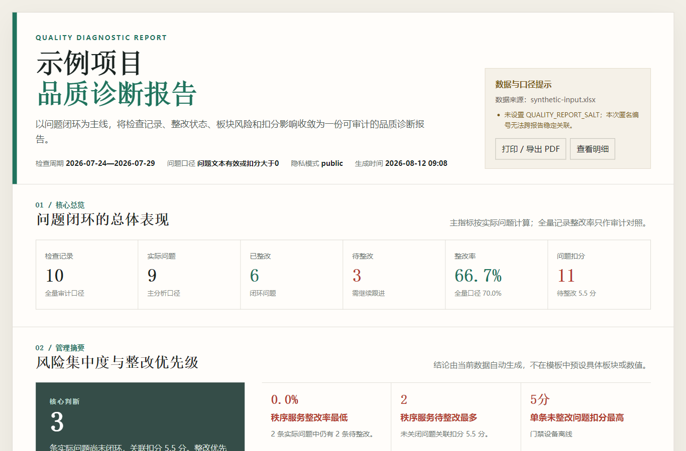
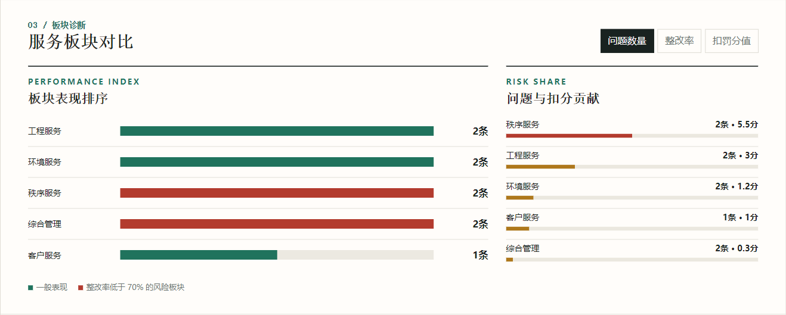
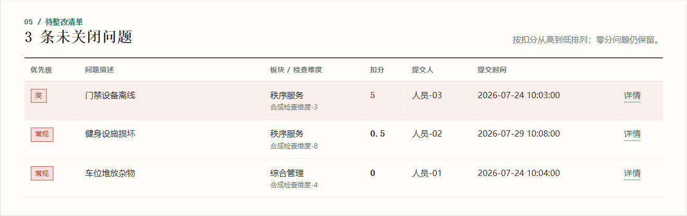

<div align="center">

# 物业品质 AI 诊断报告 Skill

### property-quality-diagnostic-report

**将物业巡检整改 Excel，一键转换为 AI 驱动的品质诊断与整改分析报告。**

面向物业品质管理部门、项目经理、品质督导及企业运营管理人员，最终输出可离线打开、可交互筛选、可直接打印的单文件 HTML。


`Excel 自动解析` · `品质问题诊断` · `整改闭环分析` · `风险识别` · `HTML 可视化报告` · `离线部署`

</div>

---

## 10 秒了解

```text
输入：物业巡检 / 品质整改 Excel
                     ↓
AI Agent：识别数据结构 → 统一指标口径 → 分析整改状态 → 发现重点风险
                     ↓
输出：管理层可直接查看的单文件 HTML 品质诊断报告
```

### 最快使用方式

安装 Skill 后，将 Excel 交给 AI Agent，并输入：

```text
使用 $property-quality-diagnostic-report 分析这份物业品质整改 Excel，
完成数据预检后生成离线 HTML 诊断报告。
```

Skill 会先展示预检结果；字段、项目范围和整改状态明确后，再生成报告。

## 最终交付物长什么样

以下图片由 Skill 使用完全合成的数据生成，展示的是原版 HTML 最终交付物，而非设计稿。报告中的项目、工单、人员和现场问题均为虚构示例。

点击图片可以查看整页长图，快速了解最终报告从管理总览、风险诊断到待整改清单和全量明细的完整形态。

[](assets/readme/report-full.png)

<table>
  <tr>
    <th width="33%">品质管理总览</th>
    <th width="33%">板块风险分析</th>
    <th width="33%">待整改问题清单</th>
  </tr>
  <tr>
    <td><a href="assets/readme/dashboard.png"></a></td>
    <td><a href="assets/readme/risk-analysis.png"></a></td>
    <td><a href="assets/readme/problem-list.png"></a></td>
  </tr>
</table>

> 公开截图必须由 `scripts/make_sample.py` 的合成数据生成并经过人工视觉复核，不得替换为真实项目报告、工单、人员或现场问题截图。

## 它能帮你做什么？

传统品质报告通常需要经历：

```text
整理 Excel → 人工统计 → 制作图表 / PPT → 反复核对 → 输出汇报材料
```

使用本 Skill 后：

```text
提交 Excel → AI Agent 自动分析 → 生成可视化报告 → 辅助复盘与管理决策
```

AI Agent 会协助完成：

- 识别工作表、表头和常见中文字段；
- 统一问题、整改状态与扣分统计口径；
- 计算问题数、整改数、整改率和风险扣分；
- 汇总业务板块、检查批次及未关闭问题；
- 自动提炼管理摘要与重点风险；
- 生成可搜索、可筛选、可打印的离线 HTML 报告。

它将物业品质管理中的数据核查、整改分析和报告表达固化为可复用的 AI 工作流，让每次分析遵循同一套口径和验证标准。

## 适用场景

| 场景 | 典型用途 |
|---|---|
| **住宅物业** | 日常品质巡检、月度品质评比、项目问题复盘 |
| **商业 / 园区物业** | 环境品质检查、工程问题分析、秩序安全分析 |
| **企业品质管理** | 周报 / 月报生成、管理层汇报、多项目数据拆分分析 |
| **项目一线管理** | 待整改追踪、重点问题督办、整改闭环复核 |

> 当前版本面向单项目报告。一个 Excel 包含多个项目时，预检会要求明确选择项目，不会静默合并或自动使用项目名称众数。

## 自动生成哪些内容

报告按照管理人员的阅读顺序组织信息。

### 1. 品质管理总览

- 检查记录与实际问题数量
- 已整改、待整改数量
- 实际问题整改率
- 问题扣分与待整改扣分
- 自动生成的管理摘要

### 2. 风险诊断

- 高风险业务板块
- 各板块问题量与整改率
- 扣分贡献与风险占比
- 检查任务 / 批次对比
- 重点未关闭问题提示

### 3. 整改闭环

- 待整改问题清单
- 问题详情与整改措施
- 整改状态和工单信息
- 按风险扣分排序追踪

### 4. 数据明细

- 按整改状态、业务板块和检查任务筛选
- 搜索问题描述、检查维度和工单号
- 查看单条记录完整详情
- 一键重置筛选与空结果提示

## 快速开始

### AI Agent 使用方式

仓库发布后，将 `<GitHub用户名>` 替换为实际仓库所有者：

```bash
npx skills add <GitHub用户名>/property-quality-diagnostic-report
```

然后上传 Excel 并调用：

```text
$property-quality-diagnostic-report

请分析这份物业品质整改 Excel。先检查字段、项目范围、问题口径和整改状态，
确认无风险后生成离线 HTML 报告；保留文件中的项目名称和业务原文。
```

如果需要脱敏版本，应在提示中明确说明用途：

```text
请生成适合内部分享的脱敏报告，不要改变指标口径。
```

### Python CLI 使用方式

运行环境：Python 3，并安装 `openpyxl`。

```bash
python -m pip install openpyxl
```

先执行预检：

```bash
python scripts/build_report.py input.xlsx --preflight-only
```

确认预检结果后生成报告：

```bash
python scripts/build_report.py input.xlsx --out outputs
```

预检存在需要人工确认的风险时，生成器会停止。应优先通过 `--sheet`、`--header-row`、`--project` 或配置文件解决；只有完成业务核实后才使用：

```bash
python scripts/build_report.py input.xlsx --out outputs --confirm-preflight
```

## 高级能力

### Excel 预检机制

生成报告前自动检查：

- 工作表、表头位置及字段映射；
- 项目分布与文件名差异；
- 整改状态及未知状态；
- 日期、重复工单和异常扣分；
- 问题判定口径及实际问题数量；
- 人员、工单、定位信息等敏感字段；
- 是否存在必须人工确认的风险。

以下情况默认阻断生成：关键字段无法识别、多项目未指定项目、未知整改状态、筛选后无实际问题、公开模式未声明合成数据，或预检风险尚未确认。

### 可配置的问题口径

默认使用 `problem-or-score`：问题描述有效，**或**扣罚分值大于 0，即计为实际问题。

| 参数 | 判定方式 |
|---|---|
| `problem-or-score` | 问题描述有效，或扣分大于 0；默认 |
| `problem-only` | 仅按问题描述判断 |
| `score-only` | 仅按扣分是否大于 0 判断 |
| `status-based` | 按整改状态判断 |

```bash
python scripts/build_report.py input.xlsx --out outputs --issue-policy problem-only
```

详细定义见 [指标口径](references/metric-policy.md)。

### 字段识别与配置

生成器根据常见中文表头识别字段，不依赖固定列序号。

| 字段 | 常见表头 | 要求 |
|---|---|---|
| 整改状态 | 整改单状态、整改状态、处理状态 | 必需 |
| 问题描述 | 问题描述、问题内容、不合格项 | 必需 |
| 业务板块 | 所属板块、业务板块、责任板块 | 必需 |
| 项目 | 项目、项目名称、小区名称 | 多项目时必需 |
| 工单号 | 整改单号、工单号、记录编号 | 建议提供 |
| 检查任务 | 品质检查任务名称、检查任务、检查批次 | 可选 |
| 检查维度 | 检查维度、检查项、检查类别 | 可选 |
| 扣罚分值 | 扣罚分值、扣分、处罚分值 | 可选，缺失按 0 |
| 整改信息 | 整改措施、实施描述、整改说明 | 可选 |
| 提交信息 | 提交人、检查人、提交时间、检查时间 | 可选、可能敏感 |

完整字段别名和配置格式见 [输入结构](references/input-schema.md)。

## 技术设计

### 指标同源

KPI、管理摘要、板块图表、检查批次、待整改清单和全量明细均由同一份标准化记录计算，避免图表与明细口径不一致。所有核心指标都可以回到明细重新计算。

### 离线优先

报告的数据、样式、脚本和图表全部嵌入单个 HTML，不依赖网络、CDN 或后端服务。文件可以直接在浏览器中打开，也适配桌面浏览、会议投屏和 A4 横向打印。

### 原文保留

本地业务报告默认保留用户 Excel 中的项目名称、问题描述和整改信息，不擅自修正疑似录入错误。Skill 不写死项目名称、检查月份、业务板块、日期或 KPI。

### 可审计验证

- 全量记录、实际问题、已整改、待整改、扣分和整改率可由明细重算；
- 各业务板块合计与总体指标一致；
- 搜索、筛选、详情弹窗和打印功能可验证；
- 1366px 与窄屏下无整页横向溢出；
- 板块诊断左右对应行的垂直坐标差不超过 1px；
- 生成的 HTML 不加载外部网络资源。

## 安全设计

公开仓库需要脱敏，**不等于默认脱敏用户上传的业务文件**。

| 模式 | 适用场景 | 数据处理 |
|---|---|---|
| `local` | 用户本地业务报告；默认 | 保留项目、工单、人员、问题描述、措施和时间 |
| `safe` | 用户明确要求匿名化或制作内部分享版 | 匿名化工单和人员，清理常见定位信息 |
| `public` | GitHub 或公开演示 | 只接受显式声明的合成数据 |

```bash
# 用户明确要求脱敏时
python scripts/build_report.py input.xlsx --out outputs --privacy safe

# 仅限完全合成的数据
python scripts/build_report.py synthetic.xlsx --out public-demo --privacy public --synthetic
```

Skill 源码、测试数据、说明文档、公开截图和 Git 历史不得包含真实项目、人员、工单、地址、本地用户名或生产问题明细。提交前运行：

```bash
python scripts/scan_sensitive.py .
```

也可以增加内部名称阻断词：

```bash
python scripts/scan_sensitive.py . --deny "内部项目名" --deny "内部公司名"
```

完整规则见 [隐私与公开发布规范](references/privacy-policy.md)。

## 测试与验证

修改解析逻辑、指标口径或报告模板后运行：

```bash
python tests/test_report.py
```

自动测试覆盖：默认本地数据保留、脱敏生成、多项目阻断、公开模式限制、通用文件名处理和敏感信息扫描。

如环境已安装 Playwright，可继续验证页面数据、响应式布局、外部资源和板块左右行对齐：

```bash
node scripts/verify_report.mjs path/to/report.html --out screenshots
```

## 合成演示数据

仓库提供合成数据生成脚本，可用于功能测试和制作公开截图，无需上传真实业务文件：

```bash
python scripts/make_sample.py synthetic-demo.xlsx
python scripts/build_report.py synthetic-demo.xlsx --out public-demo --privacy public --synthetic
python scripts/scan_sensitive.py public-demo
```

生成物不应提交进仓库；`.gitignore` 默认排除 Excel、报告输出、截图和常见本地配置文件。

## 常用参数

```text
--sheet <工作表>             指定工作表
--header-row <行号>          指定表头行
--project <项目>             从多项目文件中筛选一个项目
--project-name <名称>        控制报告中的项目名称
--title <标题>               覆盖完整报告标题
--config <config.json>       扩展字段别名、状态别名和无问题文本
--issue-policy <口径>        切换实际问题判定口径
--privacy local|safe|public  选择隐私模式
--confirm-preflight          在人工核实后确认预检风险
```

配置文件只保存通用规则，不应写入真实项目名、人员名、工单号或问题明细。

## 仓库结构

```text
property-quality-diagnostic-report/
├─ README.md                        # GitHub 产品介绍与使用说明
├─ SKILL.md                         # AI Agent 执行规范
├─ agents/openai.yaml               # Skill 展示信息与默认提示词
├─ assets/report-template.html      # 原版离线报告模板
├─ references/
│  ├─ input-schema.md               # 输入字段与配置
│  ├─ metric-policy.md              # 指标和问题口径
│  └─ privacy-policy.md             # 隐私与公开发布规范
├─ scripts/
│  ├─ build_report.py               # 预检、分析与报告生成
│  ├─ make_sample.py                # 合成测试数据
│  ├─ scan_sensitive.py             # 敏感信息扫描
│  └─ verify_report.mjs             # 浏览器端视觉与交互验证
└─ tests/test_report.py              # 自动回归测试
```

## 设计原则

- **报告服从数据**：不写死项目名称、月份、板块或指标值。
- **结论能够追溯**：每个摘要和图表都能回到明细记录。
- **异常显式阻断**：不静默合并多项目，也不猜测未知状态。
- **业务原文优先**：默认不改写用户上传文件的项目和问题信息。
- **公开内容最小化**：仓库只保存通用逻辑、模板与合成演示能力。

---

<div align="center">

**让物业品质数据从“统计材料”变成可复用、可追溯的管理诊断。**

</div>
